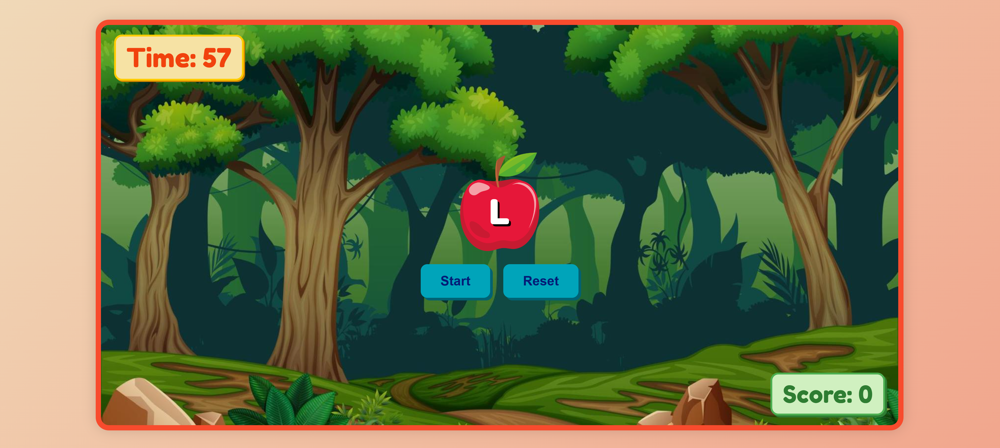

# 🍎 Fruit Slasher Game v1.0

A fun and simple typing game where alphabets appear on an apple, and the player must press the correct key to score points! The goal is to score as much as possible in 60 seconds.

Click [Here](https://mohammadzaid07.github.io/Fruit-Slasher/) to Play Now

---

## 🎮 How to Play

1. Click the **Start** button.
2. An alphabet will appear on the apple.
3. Press the correct key on your keyboard that matches the alphabet.
4. If correct, your score increases and a slash sound plays.
5. You have **60 seconds** to score as many points as you can!
6. Click **Reset** anytime to restart the game.

---

## 🧑‍💻 Tech Stack

- **HTML**
- **CSS**
- **JavaScript**

---

## 📂 Project Structure

Fruit-Slasher/

│

├── index.html         # Game layout and structure

├── style.css          # Styling and animations

├── script.js          # Game logic and interactivity

├── apple.png          # Apple image for the game

├── slash.mp3          # Sound played on correct key press

├── background.jpg     # Background image for container

├── Screenshot.png     # Screenshot of the game

└── README.md          # You're reading it!

---

## 📸 Screenshot



---

## 🚀 Features

- Dynamic random letter generation
- Real-time score updates
- 60-second countdown timer
- Responsive styling

---

## 📦 How to Run Locally

1. Clone the repo:

   ```bash
   git clone https://github.com/yourusername/alphabet-slicer.git
   cd alphabet-slicer
   ```
2. Open `index.html` in your browser.
3. Play and enjoy!
